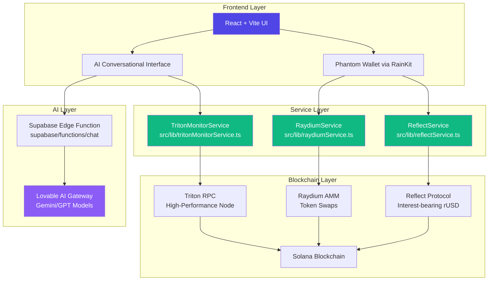

# Flow - AI-Powered Solana Savings Assistant

## 🌊 Introduction

**Flow** is an intelligent savings application built on Solana that combines AI-powered financial assistance with DeFi protocols to help users maximize their crypto earnings effortlessly. Think of it as your personal financial advisor that not only understands natural language but can also execute complex blockchain transactions on your behalf.

Flow transforms idle crypto assets into interest-earning savings, executes multi-step payment plans, tracks savings goals, and provides personalized financial insights—all through a conversational AI interface powered by cutting-edge Solana technologies.

---

## 🎯 What Flow Does

Flow is built around **5 core AI agent features**:

### 1. **Smart Sweep Agent**

Automatically detects idle USDC in your Phantom wallet and offers to convert it into interest-bearing rUSD through Reflect protocol.

**User Experience:**

- AI proactively notifies: "I noticed $52.80 idle USDC in your wallet"
- One-click sweep converts USDC → rUSD earning 5.2% APY
- Real-time earnings tracking

### 2. **Intelligent Payment Agent**

Parses complex, natural language payment requests and executes multi-step transaction plans.

**Example:**

```
User: "Pay bob.sol $20 for dinner and swap $130 for 1 SOL for that mint"
AI: "Got it. 2-step plan:
  1. Send $20 to bob.sol
  2. Swap ~$130 for 1 SOL
Sound good?"
```

### 3. **Goal-Based Auto-Pay Agent**

Connects savings goals to real-world deposits and proactively suggests allocations.

**Example:**

- User receives 2.2 SOL deposit
- AI: "You're 57% to your 'New Laptop' goal. Add $50 or $100 from this deposit?"
- One-click goal funding with automatic swaps

### 4. **Wallet Health Agent**

Monthly financial analyst providing human-readable summaries without requiring any action.

**Monthly Report:**

- Interest Earned: $12.34
- Total Saved: $100
- Forecast: ~$12.50 next month

### 5. **Solana Pay Parser Agent**

Seamlessly handles Solana Pay QR codes and payment links in a user-friendly chat interface.

**Flow:**

1. User scans QR or pastes `solana:pay?recipient=COFFEE.sol&amount=5`
2. AI displays clean payment widget
3. One-click confirm using rUSD savings

---

## 🏗️ Architecture Overview



---

## 🔧 Technology Stack & Resources

### **Core Blockchain Infrastructure**

#### 1. **Solana**

The foundation of the entire application.

**Why Solana?**

- **Speed**: ~400ms block times enable real-time financial operations
- **Cost**: Sub-cent transaction fees make micro-transactions viable
- **Scalability**: 65,000+ TPS theoretical throughput
- **Ecosystem**: Mature DeFi protocols (Reflect, Raydium) and wallet infrastructure

**Where Used:**

- All blockchain transactions
- Smart contract interactions
- Wallet management
- Transaction confirmations

**Code Location:**

- `src/components/WalletProvider.tsx` - Solana connection setup
- `src/lib/*.ts` - All service files use `@solana/web3.js`

**Resources:**

- [Solana Documentation](https://solana.com/docs)
- [Web3.js SDK](https://github.com/solana-labs/solana-web3.js)
- [Solana Cookbook](https://solanacookbook.com/)

---

#### 2. **Phantom Wallet** (via Wallet Adapter)

The user's identity and asset custody layer.

**Why Phantom?**

- **Market Leader**: Millions of monthly active users
- **Security**: Hardware wallet support, encrypted key storage
- **UX**: Seamless mobile + web experience
- **Developer Tools**: Comprehensive wallet adapter libraries

**Where Used:**

- User authentication/login
- Transaction signing
- Asset storage (USDC, SOL, rUSD)
- All feature cards (Smart Sweep, Payment, Goal tracking)

**Code Location:**

- `src/components/WalletProvider.tsx` - Wallet adapter configuration

```typescript
import { PhantomWalletAdapter } from '@solana/wallet-adapter-wallets';
const wallets = useMemo(() => [new PhantomWalletAdapter()], []);
```

- `src/components/WalletGate.tsx` - Wallet connection gating
- `src/components/Dashboard.tsx` - Wallet connection button

**Resources:**

- [Phantom Developer Docs](https://docs.phantom.app/)
- [Wallet Adapter React](https://github.com/solana-labs/wallet-adapter)

---

#### 3. **Reflect Protocol**

The savings engine providing interest-bearing stablecoins.

**Why Reflect?**

- **Yield Generation**: 5.2% APY on USDC deposits
- **Decentralization**: Permissionless, program-managed strategies
- **Tokenization**: rUSD is composable across DeFi
- **Insurance**: Credibly-neutral risk management

**Where Used:**

- **Smart Sweep Agent**: Minting rUSD from idle USDC
- **Earnings Forecasting**: APY calculations
- **Payment Agent**: Using rUSD as payment source
- **Wallet Health**: Interest earned tracking

**Code Location:**

- `src/lib/reflectService.ts`

```typescript
export class ReflectService {
  async getAPY(): Promise<number>
  async getRUSDBalance(walletAddress: PublicKey): Promise<number>
  async getIdleUSDC(walletAddress: PublicKey): Promise<number>
  async prepareSweepTransaction(userPublicKey: PublicKey, amount: number)
  async calculateProjectedEarnings(balance: number, days: number)
}
```

- `src/components/SmartSweepCard.tsx` - Uses `ReflectService`
- `src/components/ConversationalAgent.tsx` - AI queries Reflect data

**Resources:**

- [Reflect Documentation](https://docs.reflect.money/)
- [Reflect SDK (@reflectmoney/stable.ts)](https://npmjs.com/package/@reflectmoney/stable.ts)

---

#### 4. **Raydium**

The liquidity and swap execution layer.

**Why Raydium?**

- **Liquidity Depth**: $3B+ TVL, deepest on Solana
- **Efficiency**: Optimal swap routes, minimal slippage
- **SDK**: V2 SDK with TypeScript support
- **Composability**: Powers swaps for multi-step transactions

**Where Used:**

- **Intelligent Payment Agent**: USDC → SOL swaps for complex payment plans
- **Goal-Based Auto-Pay**: Converting deposits to goal currency
- **Solana Pay Parser**: Asset conversions before payments

**Code Location:**

- `src/lib/raydiumService.ts`

```typescript
export class RaydiumService {
  async initialize(owner: PublicKey)
  async swapTokens(poolId, inputMint, amountIn, slippage)
  async getBestRoute(inputMint, outputMint, amount)
  async executeSwap(poolId, inputMint, outputMint, amountIn, minAmountOut)
}
```

- `src/components/IntelligentPaymentCard.tsx` - Multi-step swap plans
- `src/components/GoalBasedAutoPayCard.tsx` - Deposit conversions

**Resources:**

- [Raydium SDK V2](https://github.com/raydium-io/raydium-sdk-V2)
- [Raydium SDK Demo](https://github.com/raydium-io/raydium-sdk-V2-demo)
- [Raydium Documentation](https://docs.raydium.io/)

---

#### 5. **Triton RPC**

High-performance blockchain data access.

**Why Triton?**

- **Speed**: Bare-metal servers, optimized for Solana
- **Reliability**: Global shared RPC pool
- **Monitoring**: Real-time transaction/balance tracking
- **Free Devnet**: Perfect for development

**Where Used:**

- **Triton Monitor Service**: Polling for idle USDC, deposit events
- **Wallet Health Agent**: Transaction history queries
- **All Services**: Connection to Solana blockchain

**Code Location:**

- `src/lib/tritonMonitorService.ts`

```typescript
export class TritonMonitorService {
  async monitorIdleUSDC(walletAddress, callback)
  async monitorDeposits(walletAddress, callback)
  async getTransactionHistory(walletAddress, limit)
}
```

- `src/components/WalletProvider.tsx` - RPC endpoint configuration

```typescript
const endpoint = useMemo(() => clusterApiUrl('devnet'), []);
// In production: use Triton endpoint
```

**Resources:**

- [Triton Website](https://triton.one/)
- [Triton Documentation](https://docs.triton.one/)

---

### **AI & Backend Infrastructure**

#### 6. **Lovable AI**

Powers the conversational intelligence.

**Why Lovable AI?**

- **Pre-configured**: No API key management required
- **Multi-model**: Access to Gemini 2.5 & GPT-5 models
- **Natural Language**: Parses complex financial commands
- **Contextual**: Understands user intent and financial state

**Where Used:**

- **All AI Agents**: Natural language understanding
- **Conversational Interface**: Chat responses
- **Intent Parsing**: Detecting payment/swap/goal requests

**Code Location:**

- `supabase/functions/chat/index.ts` - Edge function calling AI

```typescript
const response = await fetch("https://ai.gateway.lovable.dev/v1/chat/completions", {
  headers: { Authorization: `Bearer ${LOVABLE_API_KEY}` },
  body: JSON.stringify({
    model: "google/gemini-2.5-flash",
    messages: [
      { role: "system", content: "You are a helpful savings assistant..." },
      ...messages
    ]
  })
});
```

- `src/components/ConversationalAgent.tsx` - Frontend AI integration

**Resources:**

- [Lovable AI Documentation](https://docs.lovable.dev/features/ai)

---

#### 7. **Lovable Cloud (Supabase)**

Backend infrastructure for edge functions and secrets.

**Why Lovable Cloud?**

- **Edge Functions**: Serverless backend for AI calls
- **Secrets Management**: Secure API key storage
- **Real-time**: WebSocket support for live updates
- **Fully Managed**: No DevOps overhead

**Where Used:**

- AI chat backend
- Secure credential storage
- Future: User profiles, transaction history storage

**Code Location:**

- `supabase/functions/chat/index.ts` - AI gateway proxy
- `src/integrations/supabase/client.ts` - Auto-generated client
- `.env` - Environment variables (auto-managed)

---

## 📂 Project Structure

```
flow/
├── src/
│   ├── components/
│   │   ├── SmartSweepCard.tsx          # Feature 1: Auto-sweep idle USDC
│   │   ├── IntelligentPaymentCard.tsx  # Feature 2: Multi-step payment plans
│   │   ├── GoalBasedAutoPayCard.tsx    # Feature 3: Savings goal tracking
│   │   ├── WalletHealthCard.tsx        # Feature 4: Monthly reports
│   │   ├── SolanaPayParserCard.tsx     # Feature 5: QR/link payments
│   │   ├── ConversationalAgent.tsx     # AI chat interface
│   │   ├── WalletProvider.tsx          # Phantom wallet setup
│   │   ├── WalletGate.tsx              # Wallet connection gate
│   │   ├── Dashboard.tsx               # Main app layout
│   │   └── ThemeToggle.tsx             # Light/dark mode
│   ├── lib/
│   │   ├── reflectService.ts           # Reflect SDK integration
│   │   ├── raydiumService.ts           # Raydium SDK integration
│   │   └── tritonMonitorService.ts     # Triton monitoring logic
│   ├── pages/
│   │   └── Index.tsx                   # App entry point
│   └── index.css                       # Design system (HSL semantic tokens)
├── supabase/
│   └── functions/
│       └── chat/index.ts               # AI edge function
├── README.md                           # Original project README
└── INTEGRATION_GUIDE.md               # This file
```

---

## 🎨 Design System

Flow uses a **semantic color token system** with full light/dark mode support:

```css
/* Light Theme */
:root {
  --ai-blue: hsl(214 84% 56%);        /* AI accent color */
  --action: hsl(142 76% 42%);         /* Action buttons (green) */
  --gradient-ai: linear-gradient(...);
  --gradient-hero: linear-gradient(...);
}

/* Dark Theme */
.dark {
  --ai-blue: hsl(214 90% 70%);
  --action: hsl(177 100% 50%);        /* Cyan for dark mode */
  /* ... */
}
```

**All colors are HSL-based** and defined in `src/index.css`. Components use semantic tokens (e.g., `text-ai-blue`, `bg-action`) instead of direct colors.

---

## 🚀 How It Works: Feature Deep-Dives

### Feature 1: Smart Sweep Agent

**Workflow:**

1. **Monitor**: `TritonMonitorService` polls user's wallet for USDC balance
2. **Signal**: If USDC unchanged for 24h, trigger AI message
3. **Action**: User clicks "Yes, sweep it"
4. **Execute**: `ReflectService.prepareSweepTransaction()` mints rUSD
5. **Sign**: Phantom wallet prompts user signature
6. **Confirm**: AI updates chat with success message

**Code Path:**

```
SmartSweepCard.tsx
  → useEffect() → ReflectService.getIdleUSDC()
  → handleSweep() → ReflectService.prepareSweepTransaction()
  → Phantom signs → Transaction submitted
```

---

### Feature 2: Intelligent Payment Agent

**Workflow:**

1. **Parse**: User types "Pay bob.sol $20 and swap $130 for 1 SOL"
2. **NLU**: Lovable AI (`chat` edge function) extracts:
   - Intent 1: `sendPayment(bob.sol, $20)`
   - Intent 2: `performSwap(USDC, SOL, $130)`
3. **Plan**: AI returns 2-step plan widget
4. **Execute**:
   - Step 1: `ReflectService` transfers $20 rUSD
   - Step 2: `RaydiumService.executeSwap()` USDC → SOL
5. **Batch Sign**: Phantom prompts for both transactions
6. **Confirm**: AI updates chat

**Code Path:**

```
ConversationalAgent.tsx
  → sendMessage() → supabase.functions.invoke('chat')
  → Edge function → Lovable AI (NLU)
  → Returns payment plan widget
  → User clicks "Yes, proceed"
  → handleAction() triggers ReflectService + RaydiumService
```

---

### Feature 3: Goal-Based Auto-Pay

**Workflow:**

1. **Monitor**: `TritonMonitorService.monitorDeposits()` detects 2.2 SOL
2. **Signal**: AI checks user's "New Laptop" goal (57% complete)
3. **Suggest**: "Add $50 or $100 to your goal?"
4. **Execute**: User clicks "$100"
   - `RaydiumService` swaps $100 SOL → USDC → rUSD
5. **Update**: Goal widget updates to 63% complete

**Code Path:**

```
GoalBasedAutoPayCard.tsx
  → handleAddToGoal(amount)
  → RaydiumService.executeSwap(SOL, USDC, amount)
  → ReflectService.mint(USDC → rUSD)
  → Update goal state
```

---

### Feature 4: Wallet Health Agent

**Workflow:**

1. **Analyze**: Monthly cron job (backend)
2. **Query**: `TritonMonitorService.getTransactionHistory()`
3. **Calculate**: Interest earned from Reflect protocol
4. **Format**: Lovable AI creates human-readable summary
5. **Deliver**: Pushes message to user's chat

**Code Path:**

```
(Backend cron or manual trigger)
  → TritonMonitorService.getTransactionHistory()
  → ReflectService.getAPY() + balance history
  → Lovable AI formats report
  → ConversationalAgent displays widget
```

---

### Feature 5: Solana Pay Parser

**Workflow:**

1. **Scan**: User scans QR or pastes `solana:pay?recipient=...&amount=5`
2. **Parse**: AI extracts recipient, amount, label
3. **Display**: Clean payment widget (not raw URL)
4. **Execute**: `ReflectService` transfers rUSD
5. **Sign**: Phantom prompts signature
6. **Confirm**: "Paid! Enjoy your latte ☕"

**Code Path:**

```
SolanaPayParserCard.tsx
  → handleParse(url)
  → Extract params from URL
  → Display parsed widget
  → handlePay()
  → ReflectService.transfer(recipient, amount)
```

---

## 🔐 Security & Best Practices

1. **No Private Keys in Frontend**: Phantom wallet handles all key management
2. **Edge Function Proxy**: AI API key stored securely in Lovable Cloud
3. **RLS Policies**: (Future) User data protected by Supabase Row Level Security
4. **Transaction Simulation**: All transactions simulated before signing
5. **Slippage Protection**: Raydium swaps include min output amounts

---

### Installation

```bash
# Clone repository
git clone <YOUR_GIT_URL>
cd flow

# Install dependencies
npm install

# Start development server
npm run dev
```

### Environment Variables

Automatically configured by Lovable Cloud:

- `VITE_SUPABASE_URL`
- `VITE_SUPABASE_PUBLISHABLE_KEY`
- `LOVABLE_API_KEY` (Edge function only)

### Testing

1. Connect Phantom wallet (devnet)
2. Get devnet SOL from [faucet](https://solfaucet.com/)
3. Get devnet USDC (request from Solana Discord)
4. Test each feature card

---

## 🚢 Deployment

```bash
# Via Lovable UI
Click "Publish" button → Auto-deploys to lovable.app subdomain

# Custom domain
Project > Settings > Domains > Connect Domain
```

---

## 🤝 Contributing

This project was built for the [Colosseum Hackathon]. Contributions welcome!

1. Fork the repository
2. Create feature branch (`git checkout -b feature/amazing-feature`)
3. Commit changes (`git commit -m 'Add amazing feature'`)
4. Push to branch (`git push origin feature/amazing-feature`)
5. Open Pull Request

---

## 📝 License

MIT License - See LICENSE file for details

---

**Built with ❤️ on Solana**
